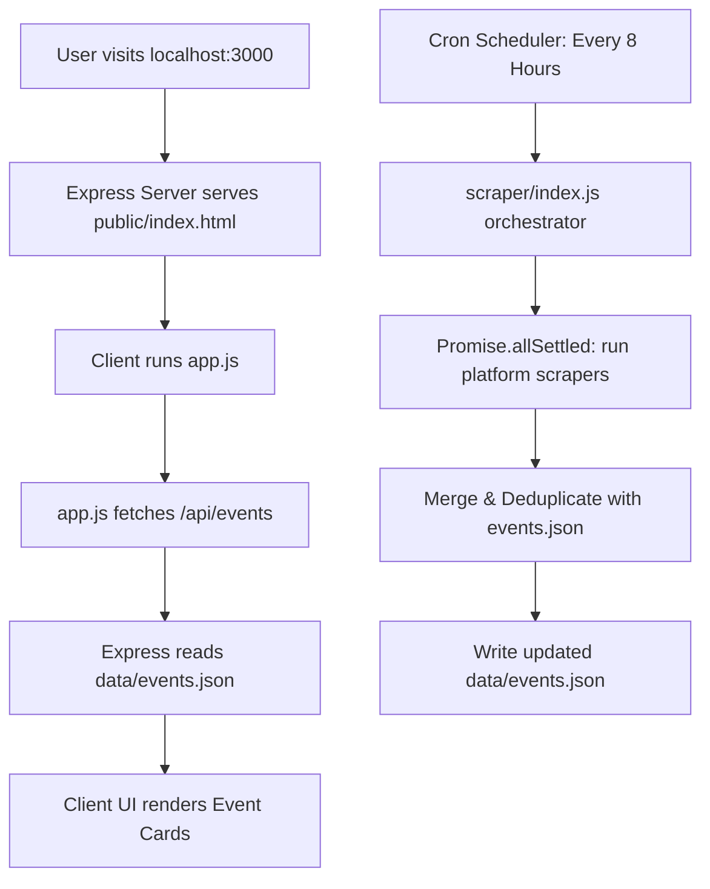

# HACK//ZONE — Student Tech Events Hub

HACK//ZONE is a modern, high-contrast web application designed to help students discover, filter, and track upcoming hackathons, workshops, and bootcamps across India. It aggregates and displays event listings with direct registration links to source platforms.

The application has been decoupled into a client-server architecture containing a frontend interface and an automated backend database/scraper.

---

## ⚡ Tech Stack

*   **Frontend**: Semantic **HTML5**, **Vanilla CSS3** (Neo-Brutalist design tokens, typography, custom cursor, and glitch keyframes), and **Vanilla JS** (interactive filters, locale-specific formatting, and async fetch integration).
*   **Backend Server**: **Node.js** with **Express** API router.
*   **Events Database**: Local database file `data/events.json` seeded with core curated records.
*   **Automated Scraper**: Modular backend scraping scripts built with **Axios** and **Cheerio** targeting:
    *   **Unstop** (uses HTML & NEXT_DATA extraction fallback)
    *   **HackerEarth** (scrapes challenge listings)
    *   **Hack2Skill** (event mapping link scraper)
    *   **Luma** (parses JSON-LD schema objects)
    *   **OpenHackathons** (accelerated bootcamp extractor)
*   **Scheduler**: **node-cron** triggers the scraping engine every 8 hours in the background.

---

## 🔄 Decoupled Architecture



---

## 📂 Directory Layout

```text
hackZone/
├── data/
│   └── events.json         # Server-side events database
├── public/                 # Client static files (served by Express)
│   ├── index.html          # Structural markup
│   ├── style.css           # Neo-brutalist styling rules
│   └── app.js              # UI filters, states, and client-side logic
├── scraper/
│   ├── index.js            # Scraper orchestrator and deduplication
│   ├── unstop.js           # Unstop parsing rules
│   ├── hackerearth.js      # HackerEarth parsing rules
│   ├── hack2skill.js       # Hack2Skill parsing rules
│   ├── luma.js             # Luma JSON-LD parsing rules
│   └── openhackathons.js   # OpenHackathons parsing rules
├── index.html              # Root developer redirection page
├── server.js               # Node.js backend & cron server
├── package.json            # NPM dependencies & running scripts
└── README.md               # Setup & project specifications
```

---

## 🚀 How to Run Locally

Follow these steps to spin up the server and scraper:

### 1. Install Dependencies
Ensure you have [Node.js](https://nodejs.org) installed, open your terminal in the project directory, and run:
```bash
npm install
```

### 2. Launch the Server
Start the Express server and scheduling loop:
```bash
npm start
```

This starts the application on **http://localhost:3000** and kicks off a background scraping run to pull fresh listings.

### 3. Run Scraper Standalone (Optional)
If you want to manually run the scraper outside of the server environment:
```bash
npm run scrape
```
This will query the platforms, add any new events, deduplicate the records, and save them to `data/events.json`.
